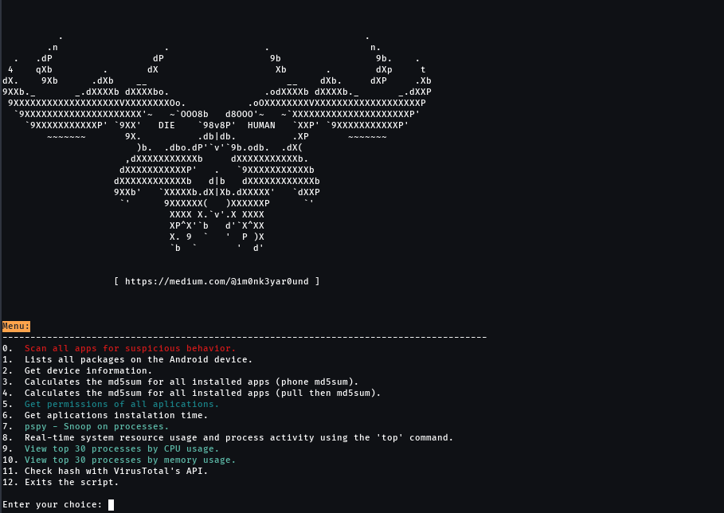
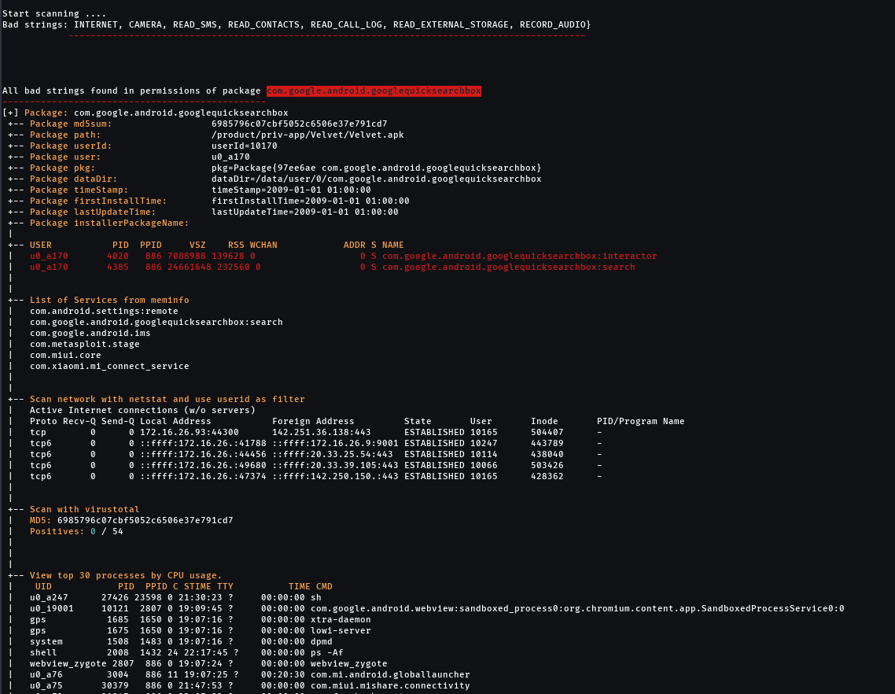
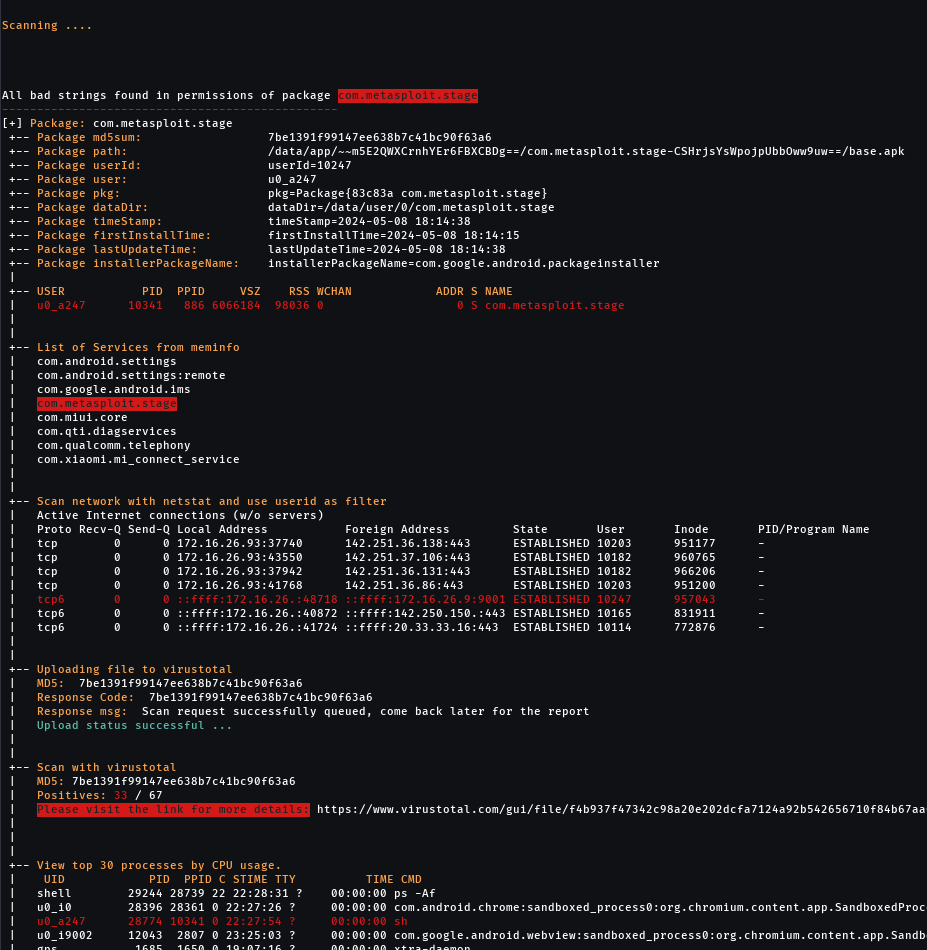
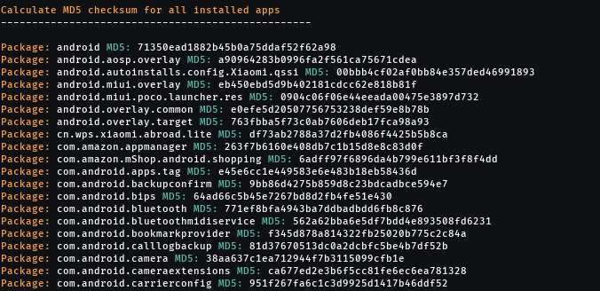
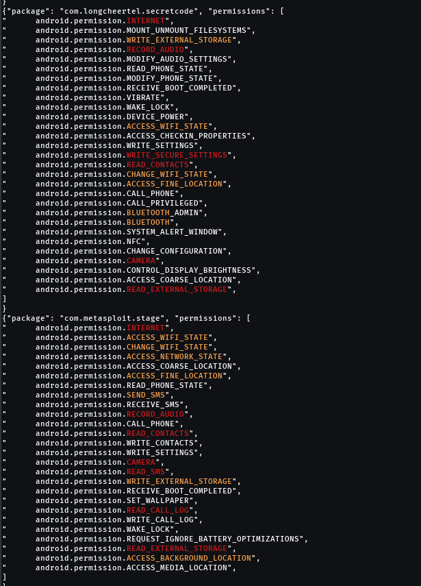
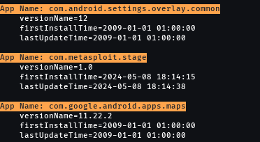
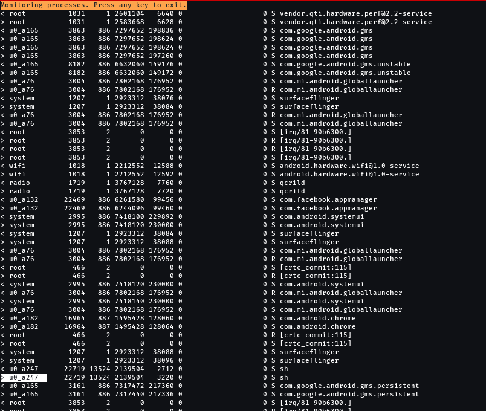
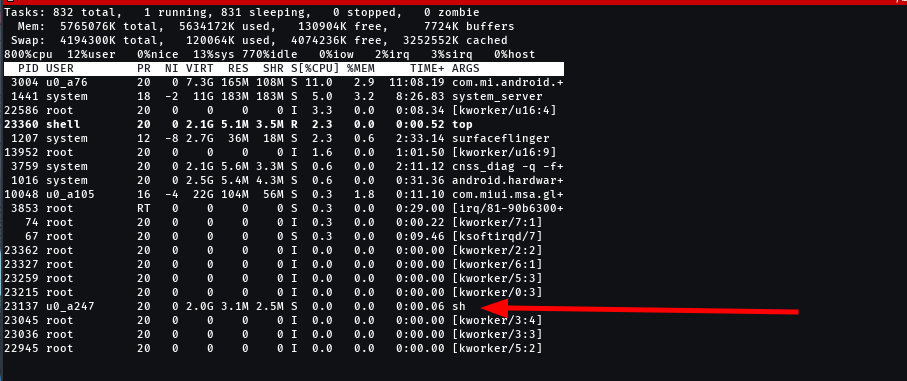
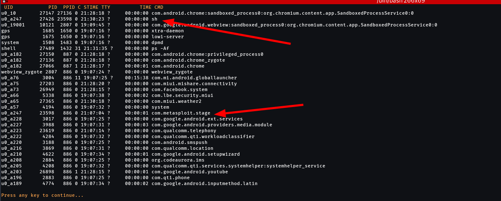
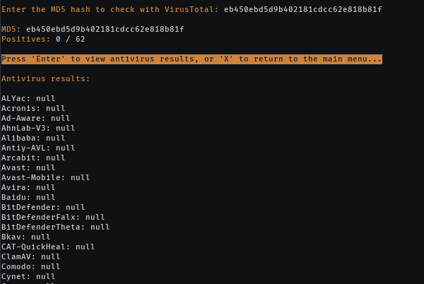

# SATH Scanner
SATH Scanner is a tool designed to scan Android packages for suspicious permissions and check for potentially malicious applications using VirusTotal.

\
&nbsp;

## Table of Contents
- [Installation](https://github.com/Im0nk3yar0und/SATH_Scanner/blob/main/README.md#installation)
- [Usage](https://github.com/Im0nk3yar0und/SATH_Scanner/blob/main/README.md#usage)
- [Functions Description](https://github.com/Im0nk3yar0und/SATH_Scanner/blob/main/README.md#functions-description)
- [Contributing](https://github.com/Im0nk3yar0und/SATH_Scanner/blob/main/README.md#contributing)
- [License](https://github.com/Im0nk3yar0und/SATH_Scanner/blob/main/README.md#license)

\
&nbsp;

## Installation

1. Clone this repository to your local machine.
```bash
git clone https://github.com/Im0nk3yar0und/SATH_Scanner.git
```
2. Ensure you have `adb` (Android Debug Bridge) installed on your computer.

\
&nbsp;

## Usage
1. Connect your Android device to your computer.
2. Ensure USB debugging is enabled on your Android device.
3. Run the script using the following command:
        
```bash
./sath_scanner.sh
```
    



\
&nbsp;

## Functions Description

#### Scan all apps for suspicious behavior
- This function scans all installed applications on the connected Android device for potentially suspicious permissions that are commonly associated with malware. It specifically checks for permissions such as **INTERNET**, **CAMERA**, **READ_SMS**, **READ_CONTACTS**, **READ_CALL_LOG**, **READ_EXTERNAL_STORAGE**, and **RECORD_AUDIO**. If any application requests all of these permissions, it triggers a more thorough scan to identify possible malware.

- This Bash script checks for the presence of a file containing a VirusTotal API key. If the file exists, it reads the key from it. If not, it prompts the user to input the API key and saves it to the file `~/.virustotal_api_key`.




\
&nbsp;

#### Lists all packages on the Android device.
- This function lists all packages installed on the connected Android device.

\
&nbsp;

#### Get device information.
- This function retrieves information about the connected Android device, including the device model, Android version, and more.

\
&nbsp;

#### Calculates the MD5 sum for all installed apps (phone MD5 sum).
- This function calculates the MD5 checksum for all installed applications directly on the phone.


\
&nbsp;

#### Calculates the MD5 sum for all installed apps (pull then MD5 sum).
- This function retrieves the APK files of installed applications from the connected Android device to the local machine and then calculates the MD5 checksum for each application.

\
&nbsp;

#### Get permissions of all applications.
- This function retrieves the permissions requested by each installed application on the Android device.


\
&nbsp;

#### Get applications installation time.
- This function retrieves the installation time of each installed application on the Android device.


\
&nbsp;

#### pspy - Snoop on processes.
- This function effectively monitors processes on the Android device in real-time and logs any changes to the pspy.log file. Users can terminate the monitoring process by pressing any key.


\
&nbsp;

#### Real-time system resource usage and process activity using the 'top' command.
- This function provides real-time system resource usage and process activity using the 'top' command on the connected Android device.


\
&nbsp;

#### View top 30 processes by CPU usage.
- This function lists the top 30 processes by CPU usage on the connected Android device.


\
&nbsp;

#### View top 30 processes by memory usage.
- This function lists the top 30 processes by memory usage on the connected Android device.

\
&nbsp;

#### Check hash with VirusTotal's API.
- This function checks the MD5 hash of a specific package against VirusTotal's API to detect potentially malicious applications.


\
&nbsp;
## Contributing
- Contributions are welcome! Feel free to open an issue or submit a pull request.

\
&nbsp;
## License
- This project is licensed under the MIT License. See the [LICENSE](https://github.com/Im0nk3yar0und/SATH_Scanner/blob/main/LICENSE) file for details.

